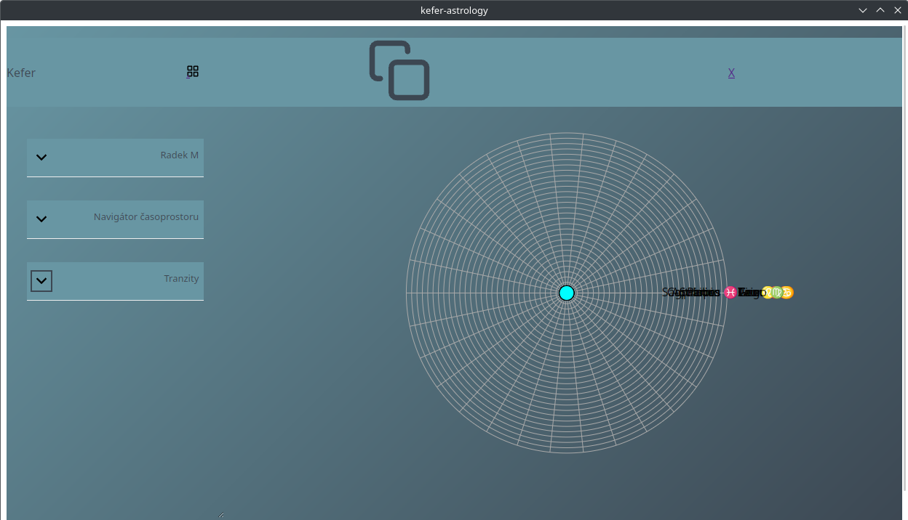

# AstroSmrk

Astrology application meant to run anywhere.
Data stored using [DuckDB](https://duckdb.org/)

# Details

- backend part build with Rust + Tauri package.
    - translation preparation
    - hold the development process
- frontend part is build in Svelte + Vite.
    - `@astrodraw/astrochart`
- start developing by `yarn tauri dev`.

## Recommended IDE Setup

[VS Code](https://code.visualstudio.com/) + [Svelte](https://marketplace.visualstudio.com/items?itemName=svelte.svelte-vscode) + [Tauri](https://marketplace.visualstudio.com/items?itemName=tauri-apps.tauri-vscode) + [rust-analyzer](https://marketplace.visualstudio.com/items?itemName=rust-lang.rust-analyzer).

